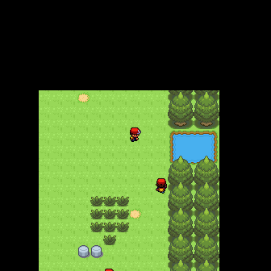
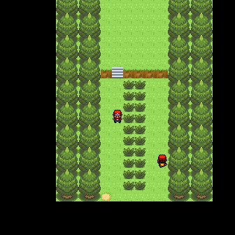

NAGM
====

Not A Game Manager

## Usage

- Install dependencies: `pip install -r requirements.txt`.
- Run test-game with: `./launch.py` (or `python -m nagm` from parent folder).

## Screenshots

 

## Credits

Tiles by WesleyFG
